# Shelfmate
書籍管理アプリです。

「この本、もう持ってたっけ…？」となったときにすぐに所持している本一覧を確認できるようになります。

PWA対応、レスポンシブ対応済みなので、スマホからでもネイティブアプリのように使えます。

# URL
[https://shelfmate.hzmintech.com](https://shelfmate.hzmintech.com/)

メールアドレス、もしくはGoogleアカウントでの新規登録が可能です。

メールアドレスの場合、登録したアドレスに確認メールが送られてくるので、それを確認した後、新規登録完了となります。

# 使用技術
- フロントエンド
  - Vue.js
- バックエンド
  - Go
- その他
  - Firebase Authentication
  - Cloud Firestore
  - Google Books API
  - 国立国会図書館API
  - Docker

# 構成図
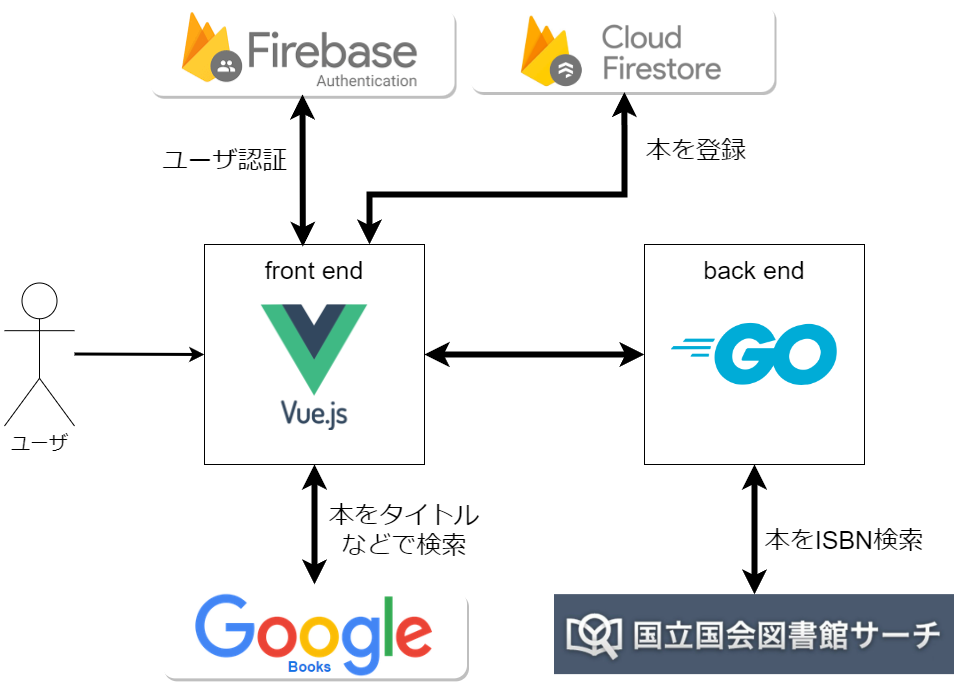

# 機能一覧
## 基本機能

### 本一覧の閲覧機能
本は自動でシリーズものかどうか振り分けられ、シリーズものは1つにまとめて表示されます。
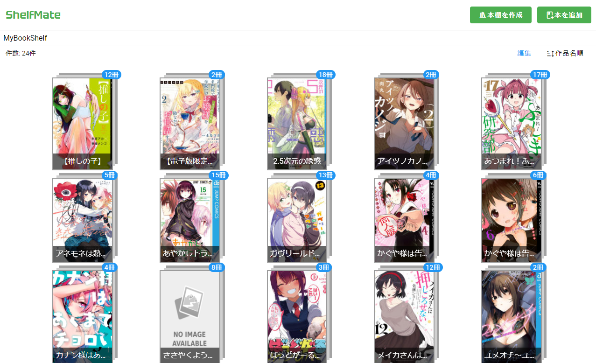

シリーズものを細かく見ることも可能です。
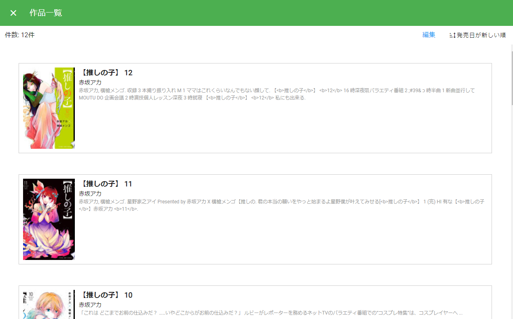

### 本の削除機能
間違えて登録したり、本を売った場合でも、本を削除することができます。

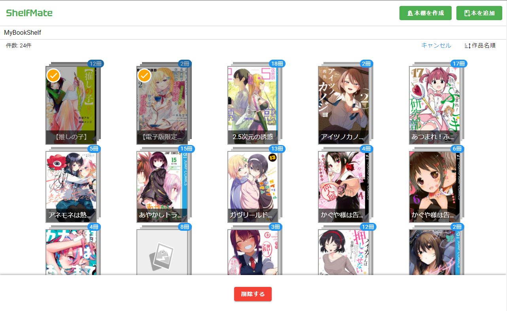
シリーズものの場合、特定の巻だけ選んで削除することも可能です。
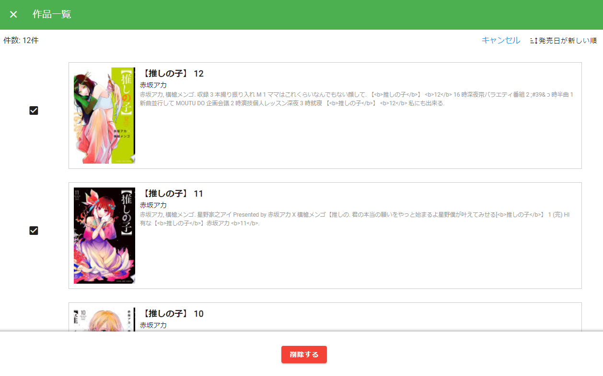

### 本の検索・登録機能

本をタイトル、著者名などで検索し、検索結果一覧から本を登録できます。

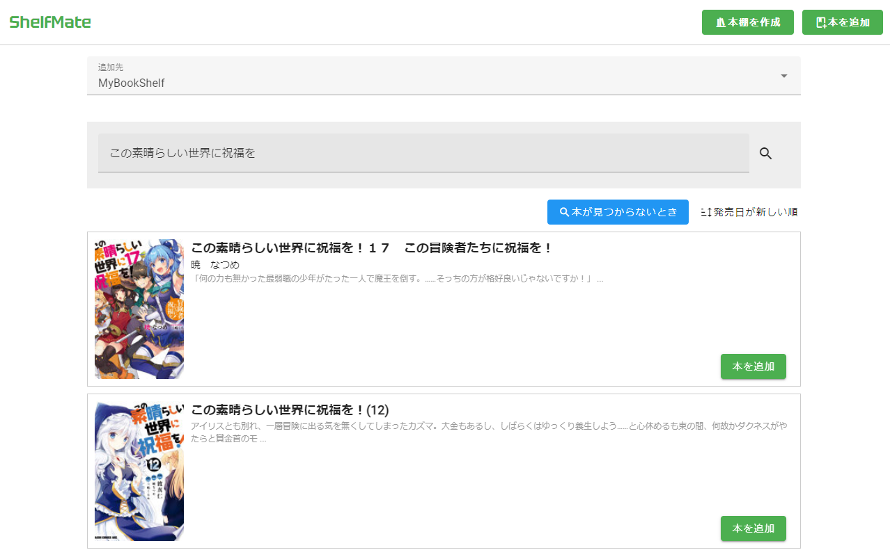

もし、本が見つからないときはISBN検索によって特定の本を正確に検索できます。

(内部的には異なる書籍検索APIを用いているため、タイトル検索で見つからなかった本も高確率で見つかります。)

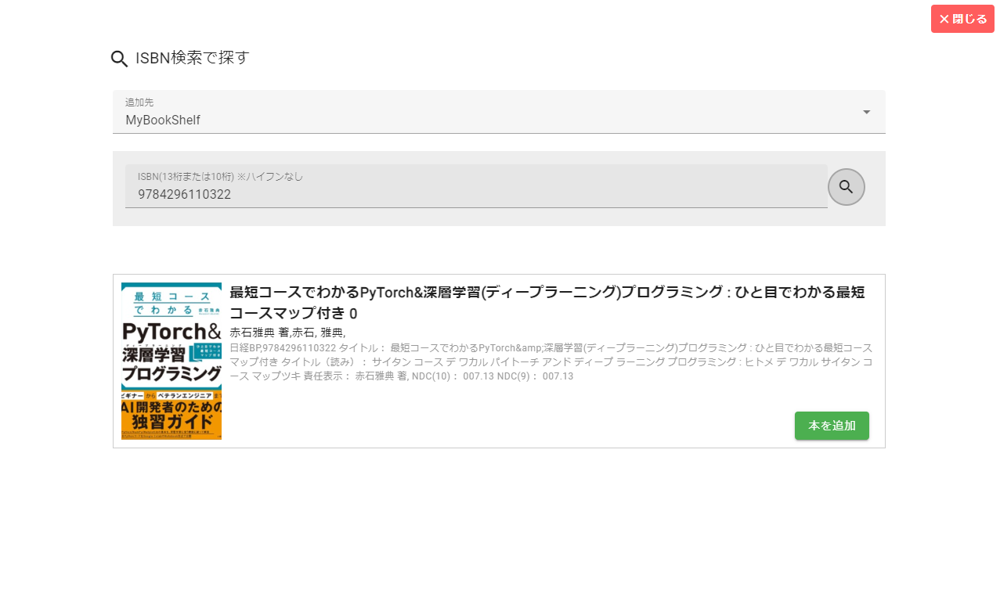
### ソート機能

本の検索結果は作品名、作者名、発売日順にソートできます。
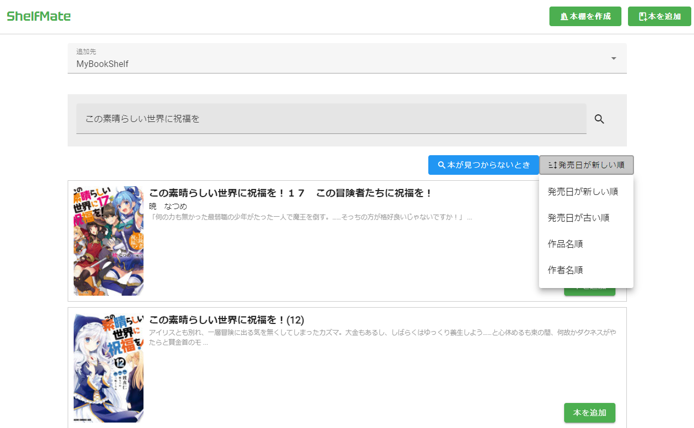

### 本棚の作成機能
本棚は複数作成することが可能です。「この本棚には漫画、ここには技術書…」というような使い分けが可能になります。
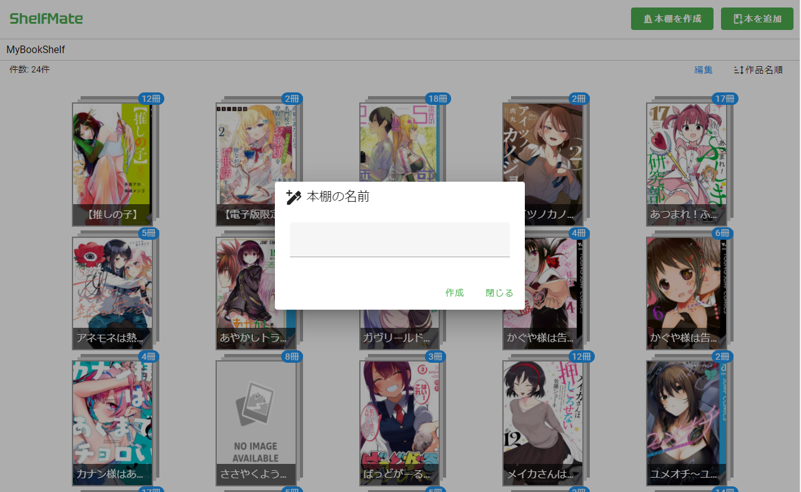

## 認証機能

- ユーザ登録
- ログイン
- Googleアカウントでのログイン・登録
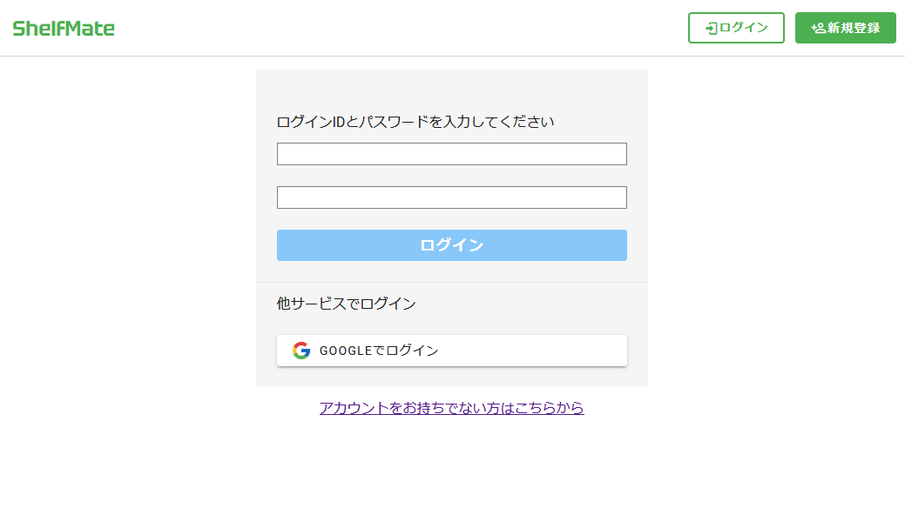
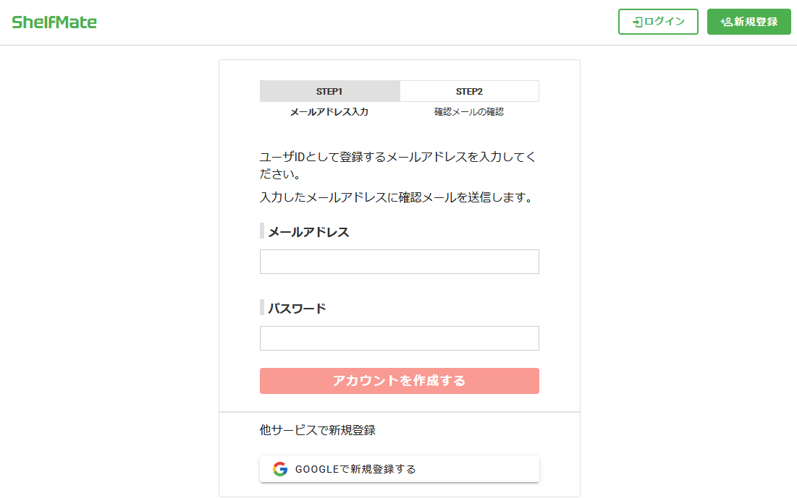
